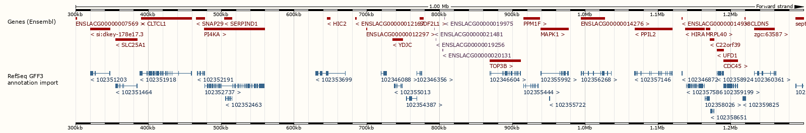
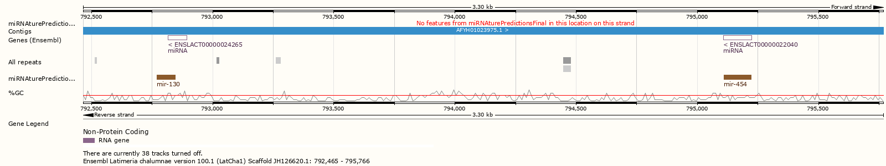

Searching miRNAs
================

The most important step will be performed! Based on the last configurations on
the script ``run_miRNAture.sh``, ``miRNAture`` will be executed on the designed
coelacanth sequences. The idea is to perform independently each of the stages, 
*homology-searches* and *detection of mature*, for demonstrative 
purposes. In case that you require to run the complete pipeline, just adjust the
parameter **-stage** to the *complete* option. 

Homology search
^^^^^^^^^^^^^^^

As mentioned, we are going to execute the *homology-search* stage. To activate
this stage in ``miRNAture`` please verify the flag value to be **-stage homology**.
In brief, our *target* coelacanth sequences would be annotated using a set of
miRNA *queries* that belong from the following chordate species, (V: vertebrata, T:
tunicata and C:cephalochordata) and one echinoderm (E):

* *Anolis carolinensis* (V)
* *Branchiostoma belcheri* (C)
* *Branchiostoma floridae* (C)
* *Ciona robusta* (T)
* *Ciona savignyi* (T)
* *Danio rerio* (V)
* *Eptatretus burgeri* (V)
* *Petromyzon marinus* (V)
* *Strongylocentrotus purpuratus* (E)
* *Xenopus laevis* (V)
* *Xenopus tropicalis* (V)

We are going to test all the capability of ``miRNAture``, using at the same time
all the available modes: ``Blast``, ``HMM``, ``Infernal`` and the final 
concatenation with ``Final``. Specifically for the pairwise-comparisons with
``Blast`` mode, we are going to use only 3 strategies: 1,9,10 and the final
concatenation and comparison with ``ALL``, but feel free to choose more or less
strategies. 

Then, just let it run typing::

    $./run_miRNAture.sh homology

A long descriptive output will be printed on the screen. Keep an eye on the ``Results/``
folder where the action is taking place. 

   .. note:: Keep in mind that ``run_miRNAture.sh`` was created as an example to run ``miRNAture`` but it does not mean that is the only way to do that. Change it according your requirements.

Homology search results
^^^^^^^^^^^^^^^^^^^^^^^

To refer directly to the results, type::

    $ cd ../Results/
    $ tree -L 1
    Results/
    ├── Blast
    ├── Final_Candidates
    ├── HMMs
    ├── Infernal
    ├── miRNAture_log_190609072022.log
    ├── miRNAture_log_22505108072023.log
    ├── miRNAture_log_23590008072025.log
    ├── miRNAture_log_4209072026.log
    └── mirnature_runLatch.sh

If everything goes well, you could see 4 log files ``miRNA_log_*.log``, a
script generated automatically to run the search strategy on ``miRNAture`` 
(``mirnature_runLatch.sh``) and the folders with homology comparisons: ``Blast/``, 
``HMMs`` and direct structure comparison: ``Infernal`` and the ``Final_Candidates``
with the final set of homology predicted miRNAs. Next, go directly to the
``Final_Candidates`` folder::

    $ cd Final_Candidates/
    $ tree -L 1
    ├── all_RFAM_Latch_Final.ncRNAs_homology.txt
    ├── all_RFAM_Latch_Final.truetable
    ├── all_RFAM_Latch_Final.truetable.discarded.table
    ├── all_RFAM_Latch_Final.truetable.joined.table
    ├── all_RFAM_Latch_Final.truetable.joined.table.db
    ├── all_RFAM_Latch_Final.truetable.temp
    └── Fasta

Where the most important file is ``all_RFAM_Latch_Final.ncRNAs_homology.txt``,
which reported all the merged candidates to miRNAs on the subject contigs
from coelacanth. The results are summarised on the following table:

==============  ===========  ============  =============== 
  Contig        Length (Mb)  Numb. miRNAs  miRNAture Pred. 
==============  ===========  ============  ===============
JH126571.1      5.98145           5          122
JH126620.1      3.03251           8          106
AFYH01291077.1  0.00106           1          0
==============  ===========  ============  ===============

The final results could be discriminated by the annotation method (Blast, HMM or
Infernal):

==============  =====  ===  ========  =============== 
  Contig        Blast  HMM  Infernal  miRNAture Pred. 
==============  =====  ===  ========  ===============
JH126571.1        22    7      93            122
JH126620.1        35    6      65            106
==============  =====  ===  ========  ===============

and even, this set of computational annotations could be visualized on a broad
genome context, generating for example a `BED <https://www.ensembl.org/info/website/upload/bed.html>`_ file and uploading it at the Coelacanth Ensembl Genome Browser, using some Linux commands as follows::

    $awk '{print $1"\t"$6"\t"$7"\t"$8"\t"$2"\t"$3}'
    all_RFAM_Latch_Final.ncRNAs_homology.txt > predicted_miRNAture.bed

Next, just upload the track on the corresponding Genome Ensembl hub (as explained in more detail `here <https://www.ensembl.org/info/website/upload/index.html>`_) as a Custom Track.

Certainly, after uploading this miRNAs coordinates you would visualize this results:

 

This image corresponds to the region ``JH126620.1:788915-822338``, which
according to the Ensembl annotation, exists 4 miRNA genes
of the families: mir-130 (ENSLACG00000021481), mir-454 (ENSLACG00000019256),
and two of mir-130 (ENSLACG00000020131, ENSLACG00000019975)

Here, ``miRNAture`` detected the same families, with overlapping regions on the
previously reported miRNAs on *L. chalumnae*.

 
And this is the second cluster, with two families, the overlapping is the same
but in one miRNA the family prediction and the strand differ:

.. figure:: secondTwo.png
    :width: 600px
    :align: center
    :height: 99px
    :alt: Genome Browser Coel
    :figclass: align-center
 
For that reason, those candidates required a complementary evaluation of their current detection and correct positioning of the *mature* miRNA sequences. 
As a final result, you could check that all the reported miRNAs on the contigs
JH126571.1 and JH126620.1 were identified. The reported miRNA on AFYH01291077.1,
was predicted as a miRNA using RFAM, but currently there is no information about
the family or mature products. ``miRNAture`` detected this candidate on the
direct Infernal searches, but it did not show an acceptable homology (for
mir-105 family) and folding values (Bitscore: 13.4 and E-value 7.8), see file
``Results/miRNA_predictionInfernal/Latch/RF00670_Latch.tab``.

On the other side, ``miRNAture`` detected new candidates that currently are not
reported on the genome annotation.

Validation of miRNA candidates
^^^^^^^^^^^^^^^^^^^^^^^^^^^^^^

An additional output was generated on the ``Final_results/`` folder and contained
all the resulted fasta sequences from the last 228 hairpin candidates, organized
by their Rfam family. Based on those regions, validated by sequence and
structure homology, the idea is to evaluate the annotation of candidate *mature*
regions that are contained in this hairpin-loop and validate their annotation
with an additional layer, supported by the structural alignments of sequences
selected from other organisms.

To do that, please execute again the script::
    
    $./run_miRNAture.sh validate

which essentially have the same input parameters, except for the ``-stage validation`` flag
that was changed to tell ``miRNAture`` that the second stage have to be
activated.

In this step, each detected miRNA candidate were grouped by their Rfam miRNA family. 
Based on this reference, previously calculated data from the family is retrieved. This 
input data, required to perform the correction of the *mature* sequences using the
``MIRfix`` program, was inferred as a product of this study [#f1]_ and
comprises this set of files:
    
    * The set of Rfam hairpin sequences.
    * The mature sequences annotated for each Rfam hairpin sequence.
    * The genomes/contigs/sequences that contained the Rfam sequences.
    * A mapping file, which explicity declares the relation between hairpin and
      their mature sequences.

For more details refer to the ``MIRfix`` `repository <https://github.com/Bierinformatik/MIRfix>`_ .
Automatically, ``miRNAture`` structure all your data and generate the required
input files to perform the *mature* annotation.

.. [#f1] From the *seed* sequences from ``Rfam`` v.12.2 and additionally the sequences from ``Rfam`` and ``miRBase`` that reported *mature* sequences.
